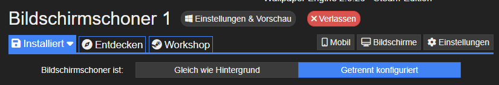
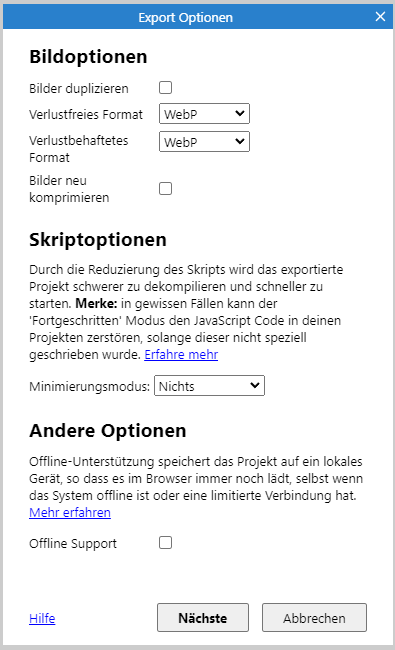

# fallingQuestsScreensaver
A website that shows solved StreetComplete-quests bouncing around as little balls, that can be used as a screensaver for example, or even as an eye-catcher at a conference etc.

## How to use it

### Using it in the browser

If you want to use it as an eye-catcher at a conference or just want to check it out, you can simply go to [this GitHub Pages Website](https://wielandb.github.io/fallingQuestsScreensaver/export/html5/) and press F11. If you want to use it as a screensaver, you can use the Steam app [Wallpaper Engine](https://store.steampowered.com/app/431960/Wallpaper_Engine/).

### How to set up the website as a screen saver using Wallpaper Engine

1: Make sure you are changing your screen saver. Go to "Installed" and select "Set screen saver" if the text above does not say "screen saver"

2: Make sure your screen saver is set to "configured seperately".

3: Go to "Open background" and then "Open from URL"

4: Paste the URL https://wielandb.github.io/fallingQuestsScreensaver/export/html5/ into the URL field, and give it a name you will remember it by later.

5: Hit "OK"

## How it works

At the start of the execution and then every minute, your browser will request the newest changes to the OSM Database. After receiving, every changeset that happened in this diff-File is checked if it was made by StreetComplete. All quest types are extracted and the corresponding balls are spawned. They have a size and weight that scales with how many changes this changeset is big, but the size of the balls is capped at 500px, while the weight is not capped. To intruduce more chaos, every ball spawns with an initial rotation and gets assigned a force vector that it will be affected by every time it collides with the floor. This assures also that all balls will slowly make their way off the screen.

### The CORS-Proxy

This program uses a CORS-Proxy I have hosted on my own website because the CORS-Policy of the OSM Planet files makes most browsers not use them when requested directly. This has the side-advantage that the proxy also caches the XML for the Diff-Files so the load this program causes on the OSM Planet Server stays minimal no matter how many people use it.

## How to contribute

### Contributing without Construct 3

This application is made with Construct 3, a proprietary and paid game engine. So to edit and contribute to the project files, you'll need Construct 3. However, the main logic is written in JavaScript and is view- and editable at this location. So if you want to contribute changes to the main logic without needing C3, you could do it by PRing the respective JS in the projectfiles-folder. Then someone with C3 could implement the changes in the project files. 

### Contributing using Construct 3

If you contribute using Construct 3, please use the following workflow:

- Open the .c3p-File to work on the project
- Make your changes
- Bump the version number, at least by one at the last digit
- Use Menu > Project > Save Project As > Single Project File and select the file in `projectfiles/single/`
- Use Menu > Project > Save Project As > Project Folder and select the folder `projectfiles/folder/`
- Use Menu > Project > Export > HTML5 to export the HTML5-Version of the project. Replace all files in `export/html5` with the files you just downloaded.

Use these settings on the export:

## License

Made with Construct 3. Licensed under MIT. The SVGs for the quests found in (among other places) /projectfiles/folder/files/quests are taken from [StreetComplete](https://github.com/streetcomplete/StreetComplete/) and are licensed under CC-BY-SA.
